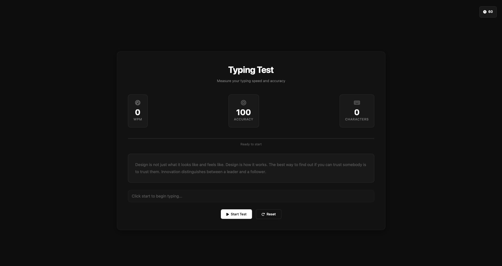

# Typing Speed Tester ⌨️

A clean and minimal typing test app built using HTML, CSS, and JavaScript. Tracks **Words Per Minute (WPM)**, **accuracy**, and total characters typed in **real-time**.

## 🚀 Features

- Real-time WPM calculation
- Live 60-second timer
- Accuracy and character tracking
- Responsive and minimal UI
- Built without any frameworks or libraries

## 🖼 Preview

## 🌐 Live Demo

👉 [Try it on GitHub Pages](https://kartikjindal99.github.io/typing-speed-tester/)

## 📁 Project Structure

typing-speed-tester/
│
├── index.html # HTML structure
├── style.css # All styling
├── script.js # Typing logic
└── README.md # Project documentation

## 🛠 Built With

- HTML5
- CSS3
- JavaScript (Vanilla)

## 🧑‍💻 Author
Made with ❤️ by **Kartik Jindal**  
🔗 [GitHub](https://github.com/kartikjindal99)
